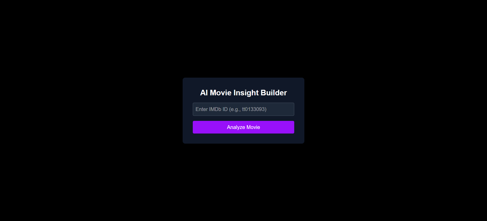
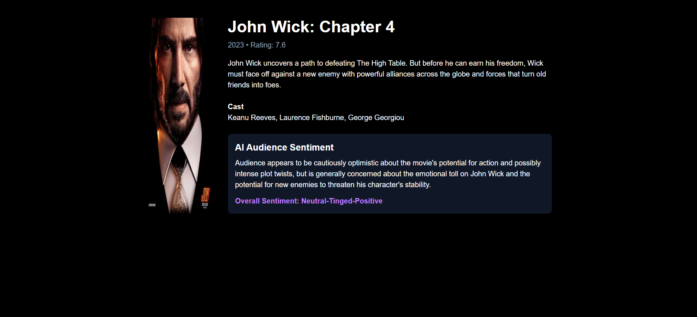

# AI Movie Insight Builder

## Overview

AI Movie Insight Builder is a full-stack web application that allows
users to enter an IMDb movie ID and instantly view detailed movie
information along with AI-generated audience sentiment insights. The
application fetches movie data such as title, poster, cast, release
year, rating, and plot, then uses an AI model to analyze the plot and
generate a summarized audience sentiment with a classification
(Positive, Mixed, or Negative).

The project is built using modern JavaScript technologies and follows
clean architecture principles to keep the code modular, maintainable,
and easy to extend.

------------------------------------------------------------------------

## Features

-   Search movie details using IMDb ID
-   Display movie title, poster, cast, release year, rating, and plot
-   AI-generated audience sentiment summary
-   Sentiment classification (Positive / Mixed / Negative)
-   Responsive and clean UI
-   Error handling for invalid movie IDs
-   Loading states while fetching data

------------------------------------------------------------------------

## Tech Stack

### Frontend

-   Next.js (React)
-   TypeScript
-   Tailwind CSS

### Backend

-   Next.js API Routes

### APIs & Services

-   OMDb API for movie data
-   Groq API (LLM) for AI sentiment analysis

------------------------------------------------------------------------

## Project Structure

    app/
     ├── api/
     │    └── sentiment/
     │         └── route.ts
     ├── movie/
     │    └── [id]/
     │         └── page.tsx
     └── page.tsx

    components/
     └── SentimentCard.tsx

    services/
     └── omdb.ts

    types/
     ├── movie.ts
     └── sentiment.ts

------------------------------------------------------------------------

## Setup Instructions

### 1. Clone the Repository

    git clone <repository-url>
    cd ai-movie-insight-builder

### 2. Install Dependencies

    npm install

### 3. Create Environment Variables

Create a `.env.local` file in the root directory.

    OMDB_API_KEY=your_omdb_api_key
    GROQ_API_KEY=your_groq_api_key

### 4. Run the Development Server

    npm run dev

Open the application in your browser:

    http://localhost:3000

------------------------------------------------------------------------

## Usage

1.  Open the homepage.
2.  Enter an IMDb movie ID (example: `tt0133093`).
3.  The application fetches movie information from the OMDb API.
4.  The AI model analyzes the movie plot and generates a sentiment
    summary.
5.  The results are displayed with a sentiment classification.

------------------------------------------------------------------------

## Assumptions

-   Audience sentiment is inferred from the movie plot due to limited
    access to large datasets of audience reviews.
-   AI-generated sentiment is used as an approximation of audience
    opinion rather than an exact representation.
-   IMDb ID format must follow the pattern `tt########`.

------------------------------------------------------------------------

## Screenshots

- Homepage

- Movie Page

------------------------------------------------------------------------

## Deployment

Live Application Link:

[Open App on Vercel](https://ai-movie-insight-black-two.vercel.app/)

------------------------------------------------------------------------

## Future Improvements

-   Fetch real audience reviews from multiple sources for more accurate
    sentiment analysis
-   Add movie search by title instead of only IMDb ID
-   Improve UI with animations and enhanced movie cards
-   Add caching for API responses to reduce latency
-   Implement unit tests and end-to-end tests

------------------------------------------------------------------------

## Author

Hardik Kumar
